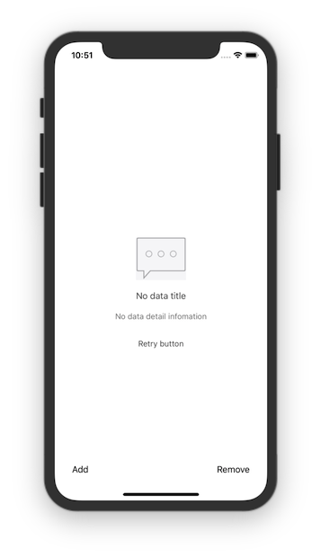

# SREmptyDataView
The empty view of UItableView and UICollectionView when no data.



## 实现原理
> 通过 hook UITableView 和 UICollectionView 更新列表的方法, 实现了自动根据列表是否有数据决定显示还是隐藏占位视图.

## 使用场景
> 通常第一次请求列表数据之前, 我们不希望显示占位视图. 但是由于此时无任何数据, 所以此库会自动推断为需要显示占位视图.  
> 为了避免这种情况, 提供了 sr_startLoadingData: 和 sr_endLoadingData 方法, 用于加载数据之前和加载数据之后调用. 具体使用方式请参考 Demo.

## API

````objc
@interface SREmptyDataBaseView : UIView
/**
 通过配置参数, 快速创建一个列表无数据时的占位视图.
 如果传递的参数为 nil, 则不会创建相应控件.

 @param icon     提示图标.
 @param title    提示标题.
 @param detail   提示描述.
 @param btnTitle 重试按钮标题.
 @param btnBlock 重试按钮回调 Block.
 @return 占位视图.
 */
+ (instancetype)sr_emptyDataViewWithIcon:(NSString *)icon title:(NSString *)title detail:(NSString *)detail btnTitle:(NSString *)btnTitle btnBlock:(SRTapBlock)btnBlock;

/**
 通过自定义的视图, 快速创建一个列表无数据时的占位视图.

 @param customView 自定义视图.
 @return 占位视图.
 */
+ (instancetype)sr_emptyDataViewWithCustomView:(UIView *)customView;

+ @end

@interface UIScrollView (SREmptyData)

/**
 列表无数据时的占位视图.
 */
@property (nonatomic, strong) SREmptyDataView *sr_emptyDataView;

/**
 用于加载列表数据之前调用, 避免因为没有数据造成的自动显示占位视图.
 */
- (void)sr_startLoadingData;

/**
 用于加载数据完成, 刷新列表之后调用, 自动推断是否显示占位视图.
 */
- (void)sr_endLoadingData;

/**
 通过此方法强行显示占位视图.
 */
- (void)sr_showEmptyDataView;

/**
 通过此方法强行隐藏占位视图.
 */
- (void)sr_hideEmptyDataView;

@end
````

## Usage

````objc
- (void)setupTableView {
    _tableView = [[UITableView alloc] initWithFrame:self.view.bounds style:UITableViewStylePlain];
    _tableView.dataSource = self;
    _tableView.delegate = self;
    _tableView.tableFooterView = [UIView new];
    [self.view addSubview:_tableView];
    [self.view sendSubviewToBack:_tableView];
    
    _tableView.sr_emptyDataView = [SREmptyDataView sr_emptyDataViewWithIcon:@"no_data" title:@"No data title" detail:@"No data detail infomation" btnTitle:@"Retry button" btnBlock:^{
        [self.tableView sr_startLoadingData];
        dispatch_after(dispatch_time(DISPATCH_TIME_NOW, (int64_t)(2.0 * NSEC_PER_SEC)), dispatch_get_main_queue(), ^{
            [self.datas addObjectsFromArray:@[@"Test data", @"Test data", @"Test data"]];
            [self.tableView reloadData];
            [self.tableView sr_endLoadingData];
        });
    }];
    _tableView.sr_emptyDataView.autoManagement = NO; // 手动管理空白视图的显示和隐藏
}

- (void)requestData {
    [self.tableView sr_startLoadingData]; // 加载数据前调用此方法, 隐藏空白视图
    dispatch_after(dispatch_time(DISPATCH_TIME_NOW, (int64_t)(2.0 * NSEC_PER_SEC)), dispatch_get_main_queue(), ^{
        [self.datas addObjectsFromArray:@[@"Test data", @"Test data", @"Test data"]];
        [self.tableView reloadData];
        [self.tableView sr_endLoadingData]; // 加载数据完成后调用此方法, 根据列表是否有数据来决定是否显示空白视图
    });
}
````